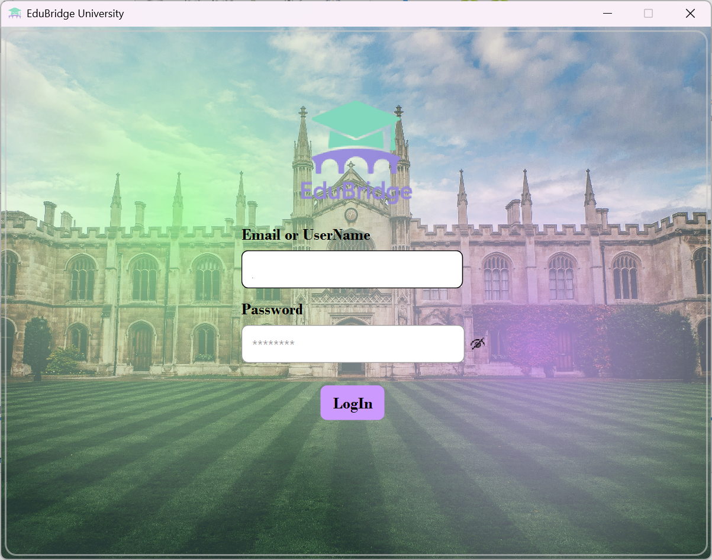
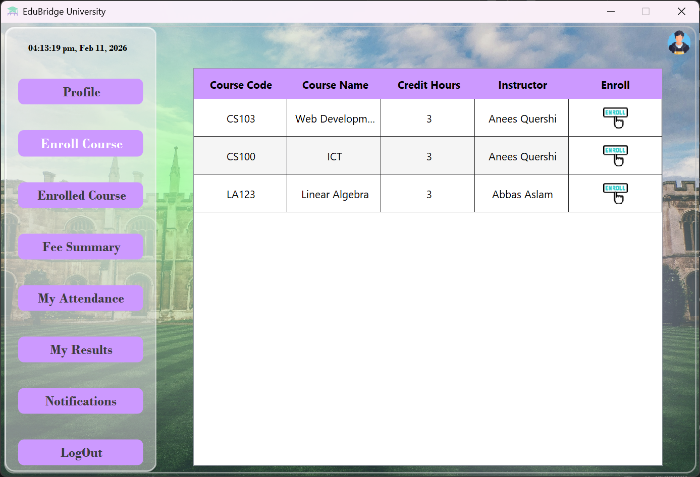
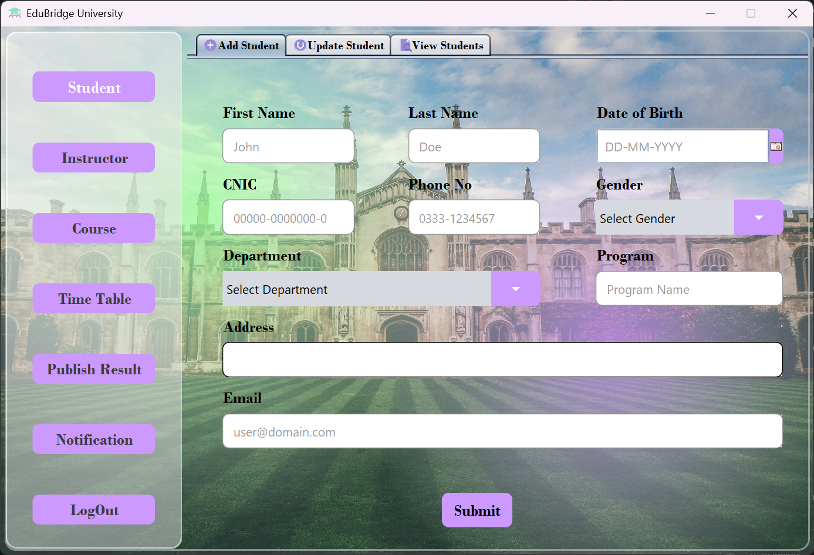
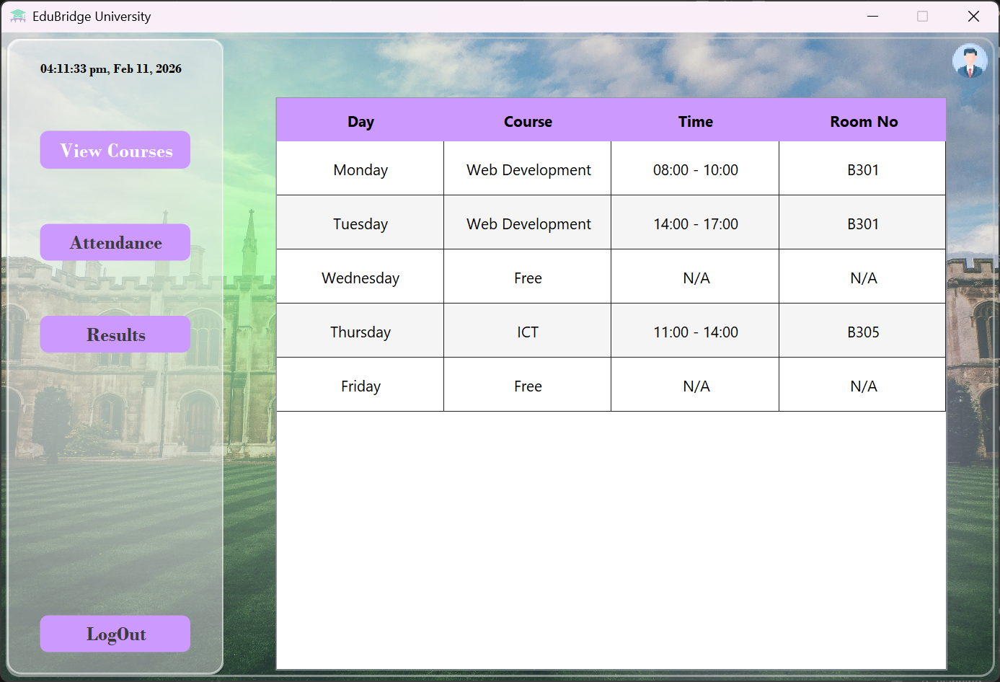

# EduBridge University Project

## Overview
EduBridge University is a comprehensive management system designed for educational institutions. Built with Java Swing, it provides a user-friendly interface for different user roles to manage academic activities, records, and profiles efficiently.

## Features
- **Multi-Role Support**: Distinct dashboards and functionalities for:
  - **Admin**: Full system control and management.
  - **Instructor**: Manage courses, students, and grading.
  - **Student**: View courses, grades, and profile.
- **Graphical User Interface (GUI)**:
  - Modern design with Glassmorphism effects.
  - Custom UI components (Rounded buttons, text fields, tables).
  - Responsive layout using Gradient Panels.
- **Authentication System**:
  - Secure Login with role-based redirection.
  - Password visibility toggle.
  - Interactive login feedback (Success/Failure alerts).
- **Database Connectivity**:
  - Robust MySQL database integration.
  - Persistent data storage for users, courses, and academic records.


## Screenshots
<!--
[](screenshots/login.png)
[](screenshots/student_dashboard.png)
[](screenshots/admin_dashboard.png)
[](screenshots/instructor_dashboard.png)
-->

## Project Structure
The project is organized into the following packages:
- `src.main`: Contains core business logic, database connection (`Database.java`), authentication (`LogIn.java`), and dashboard controllers.
- `src.ui`: Contains custom UI components like `GlassmorphismPanel`, `GradientPanel`, etc.
- `images` / `resources`: Stores assets like icons and logos.

## Prerequisites
- **Java Development Kit (JDK)**: Ensure JDK 8 or higher is installed.
- **NetBeans IDE**: Recommended for the best development experience (project uses NetBeans generated forms).
- **MySQL Database**: A MySQL server instance.
- **JDBC Driver**: MySQL Connector/J (usually included in libraries).

## Setup & Installation
1.  **Clone the Repository**:
    ```bash
    git clone <repository_url>
    ```
2.  **Database Setup**:
    - Open your MySQL management tool (e.g., PHPMyAdmin, MySQL Workbench).
    - Create a new database named `edubridge`.
    - Import the `edubridge.sql` file located in the root directory of this project.
3.  **Open Project**:
    - Open NetBeans IDE.
    - Go to `File > Open Project` and select the project folder.
4.  **Run Application**:
    - Navigate to `src/main/LogIn.java`.
    - Right-click and select `Run File` (Shift+F6).

## Usage
- Launch the application to see the Login Screen.
- Enter your credentials (Email/ID and Password).
- The system will automatically direct you to the appropriate dashboard (Admin, Instructor, or Student) based on your credentials.

## Technologies Used
- **Language**: Java
- **GUI Framework**: Swing
- **Database**: MySQL
- **IDE**: NetBeans
